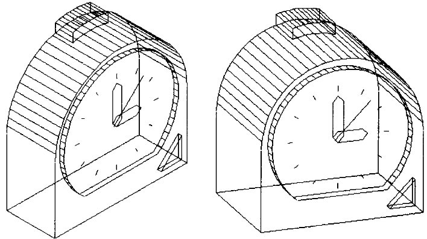

# opengl-3d-clock

## Задание

Написать программу, рисующую проекцию трехмерного каркасного объекта.

## Требования
- [x] Грани объекта рисуются с помощью доступных функций рисования отрезка в координатах окна. 
- [ ] При этом  использовать шейдеры GLSL и OpenGL;
- [ ] Ортогональное и перспективное проецирование;
- [x] Перемещения, повороты и масштабирование многогранника по каждой из осей независимо от остальных;
- [x] Генерация многогранника с заданной мелкостью разбиения;
- [x] При запуске программы объект сразу должно быть хорошо виден;
- [x] Пользователь имеет возможность вращать фигуру (2 степени свободы) и изменять параметры фигуры;
- [ ] Возможно изменять положение наблюдателя;
- [x] Нарисовать оси системы координат;
- [ ] Все варианты требований могут быть выбраны интерактивно;

## Рисунок задания

